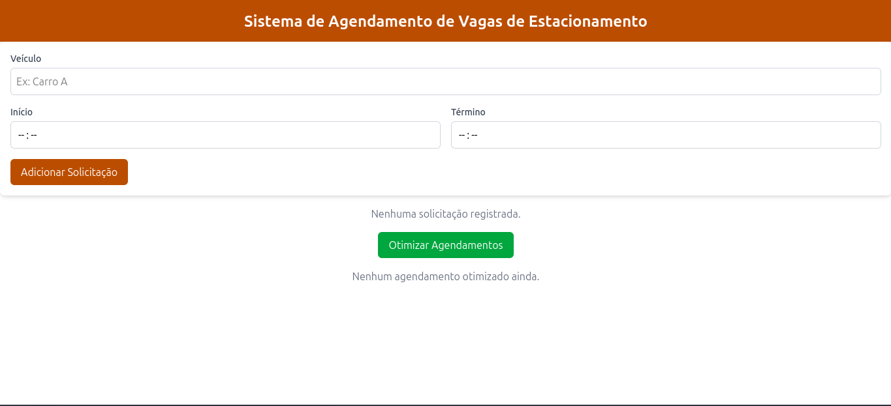

# Greed_Projeto_Dupla13

**Número da Lista**: 3<br>
**Conteúdo da Disciplina**: Greed<br>

## Alunos
|Matrícula | Aluno |
| -- | -- |
| 222006490  |  Vinícius de Jesus Bessa Fernandes |
| 231011865  |  Willian Wagner Xavier Ramos da Silva |

## Sobre 
[Descreva os objetivos do seu projeto e como ele funciona. ]: #
O projeto foi desenvolvido com base no conteúdo de algoritmos ambiciosos e resultou em uma aplicação web para agendamento de estacionamento. Nela, o usuário informa a identificação do veículo, além dos horários de chegada e saída. Em seguida, aplica-se um algoritmo de otimização de vagas fundamentado no **Interval Scheduling**, que trata cada agendamento como uma tarefa com horário de início e horário de término.<br><br>
Duas tarefas são consideradas compatíveis quando não há sobreposição de horários, e o objetivo do algoritmo é encontrar o maior conjunto possível de tarefas compatíveis, o que garante o uso mais eficiente das vagas disponíveis no estacionamento.

## Screenshots
[Adicione 3 ou mais screenshots do projeto em funcionamento.]: #
### Tabela de registros e nenhuma otimização realizada

### Tabela de registros preenchida

### Agendamentos otimizados


## Instalação
[**Linguagem**: xxxxxx<br>]: #
[**Framework**: (caso exista)]: #<br>
Linguagem: JavaScript;<br>
Biblioteca: React.js;<br>
Framework: Tailwind CSS, Express.js.

## Uso
[Explique como usar seu projeto caso haja algum passo a passo após o comando de execução.]: #
Para executar a aplicação, é necessário abrir **dois terminais**: um para o **frontend** e outro para o **backend**.<br>  
Siga as etapas abaixo:

```bash
# Terminal 1
cd frontend && npm install && npm run dev
```
```bash
# Terminal 2
cd backend && npm install && npm run dev
```
## Vídeo
[Quaisquer outras informações sobre seu projeto podem ser descritas abaixo.]: #

[Vídeo de explicação do projeto](https://youtu.be/)
